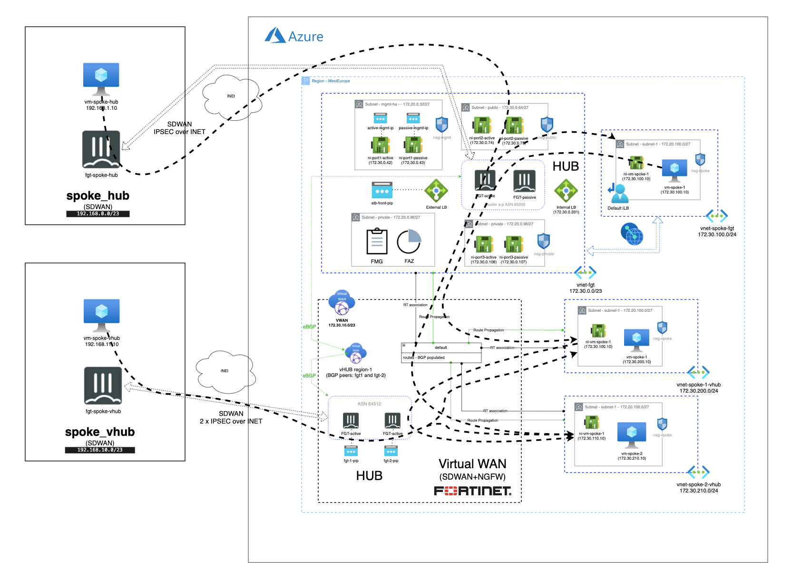
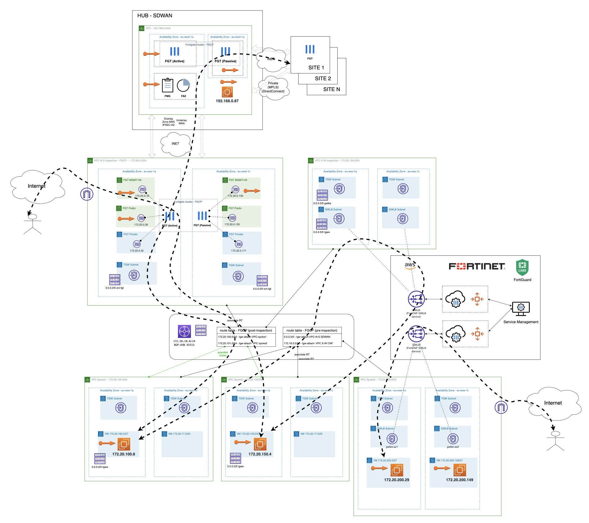

# Demos showed in expert workshop
## Introduction

This repository contain Terraform code of two demos showed in an expert workshop with enterprise customers. 

## Demos
- Azure HUB and spoke topology with VNet peering to central inspection, a cluster of fortigates is deployed in a central VNet peered with spoke VNet. Same topology within Virtual HUB is showed where a fortigate Firewall as a Service is deployed and using Azure Intent Routing traffic is address to the service. [Azure_hub-spoke_vwan](./Azure_hub-spoke_vwan/)

- AWS VPC central inspection in a HUB and spoke topology for N-S and VPC for E-W traffic inspecction with Fortinet Fortigate CNF Firewall as a Service. [AWS_TGW_FortigateCNF](./AWS_TGW_FortigateCNF/)

## Deployment considerations:
   - Create file terraform.tfvars using terraform.tfvars.example as template 
   - Update variables in var.tf with fortigate cluster deployment
   - You will be charged for this deployment

## Requirements
* [Terraform](https://learn.hashicorp.com/terraform/getting-started/install.html) >= 1.0.0
* Check particulars requiriments for each deployment (Azure and AWS) 

# Support
This a personal repository with goal of testing and demo Fortinet solutions on the Cloud. No support is provided and must be used by your own responsability. Cloud Providers will charge for this deployments, please take it in count before proceed.

