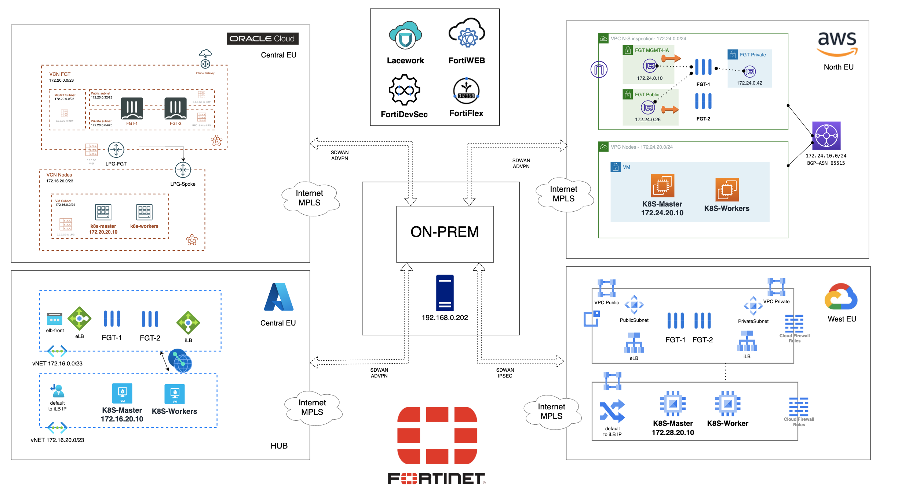
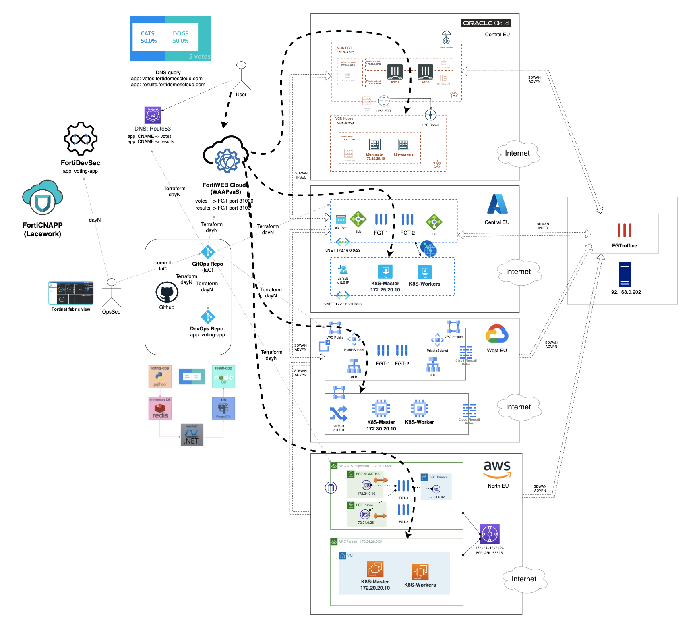

# From Code to Cloud with Fortinet - MultiCloud APP demo

## Introduction
This project provides an illustration of how an environment can be utilized to establish a comprehensive CICD (Continuous Integration and Continuous Deployment) cycle for an application utilizing an Agile methodology and GitOps. The security aspect has been given due consideration throughout the application's life cycle, from coding to runtime with Fortinet security services solutions as FortiDevSec, FortiCNAPP (Lacework), FortiWeb Cloud SaaS and Fortigate NGFW. 

## Overview

### [day0_IaC_ftnt_az_oci_gcp_k8s](./0_day0_IaC_ftnt_az_oci_gcp_k8s): 
  - Day 0 deployment of all necessary infrastructure in each three Cloud Service Providers (CSP: Azure, Oracle and GCP): 
  - Hub-Spoke topology with central inspection vpc/vnet (N-S and E-W).
  - Kuberntes cluster. 
  - FortiGates.
  - FortiManager and FortiAnalyzer.
  - Cloud providers infraestructure to deploy FortiGates and servers.

### [1_day0_IaC_ftnt_aws_gcp_k8s](./1_day0_IaC_ftnt_aws_gcp_k8s): 
  - Day 1 deployment new infrastructure in other providers and integrate in the SDWAN network (CSP: AWS and GCP): 
  - FortiGates deployed as spokes of the the SDWAN network.
  - Kuberntes cluster. 
  - Cloud providers infraestructure to deploy FortiGates and servers.

### [dayN_fgt_config_Ansible](./2_dayN_fgt_config_Ansible): 
  - Playbooks to configure FortiGates deployed in AWS and GCP.
  - Provided a bootstrap script to create ansible-playbooks and necessary variables to run the playbook. [script][./2_dayN_fgt_config_Ansible/0_bootstrap/init.sh]
  - Create policies and VIPs to permit publish application through FortiGates. 

### [dayN_IaC_k8s_app](./3_dayN_IaC_k8s_app): 
  - Day N deployment to create a CICD pipeline to deploy and run an application (Votting APP):
  - New GitHub repository with configured Actions workflow and secrets to seamlessly deploy application in deployed K8S cluster and be analyzed by FortiDevSec. 
  - First commit of code to new repo and launch first workflow to deploy APP in Kubernetes clusters. 
  - Update FortiGate firewall policy using Terraform, to allow new APP (Azure and OCI, AWS and GCP need to be create in [point 2](#dayn_fgt_config_ansible) with Ansible)
  - Create new FortiWEB Cloud application.
  - Create new DNS CNAME point FQDN APP to FortiWEB Cloud ({csp}-backend.securityday-demo.com).


## Diagram solution

0 day infrastructure deployment (Ops/Sec team)


N day infrastructure deployment (DevSecOps team)



## Deployment
* Clone the repository.
* Change necessary values in terraform.tfvars.example.  And rename `terraform.tfvars.example` to `terraform.tfvars`.
* Update 0-UPDATE-locals.tf to customize your deployment. 
* If using SSO, uncomment the token variable in variables.tf and providers.tf
* Initialize the providers and modules:
  ```sh
  $ terraform init
  ```
* Submit the Terraform plan:
  ```sh
  $ terraform plan
  ```
* Verify output.
* Confirm and apply the plan:
  ```sh
  $ terraform apply
  ```
* If output is satisfactory, type `yes`.


## Destroy the instance
To destroy the instance, use the command:
```sh
$ terraform destroy
```

# Support
This a personal repository with goal of testing and demo Fortinet solutions on the Cloud. No support is provided and must be used by your own responsability. Cloud Providers will charge for this deployments, please take it in count before proceed.
