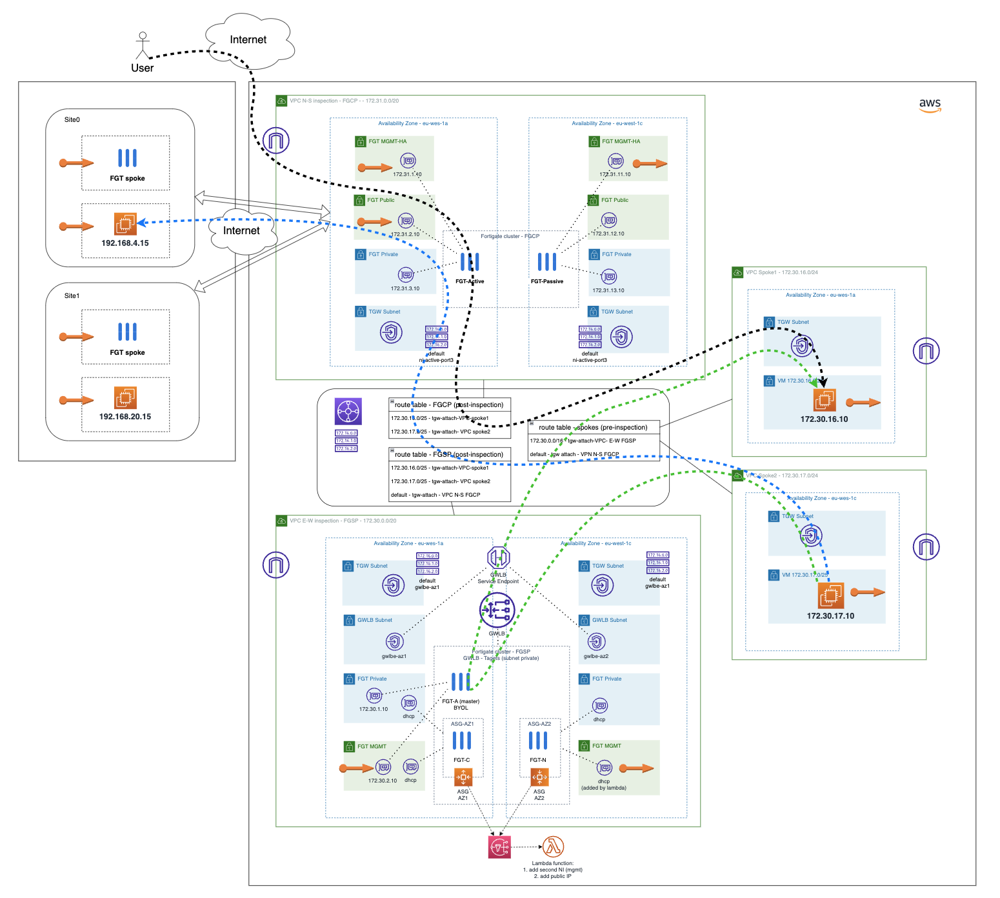

# AWS Transit Gateway for N-S traffic inspection and E-W AWS GWLB for E-W traffic with autoscaling
## Introduction
This project gives an example of a scenario using [AWS Transit Gateway](https://aws.amazon.com/transit-gateway/) product to route traffic to two VPC inspections with Fortigate cluster. Firtsly, one VPC with a Fortigate active-passive cluster will inspect N-S traffic to Internet and SD-WAN sites connected to it. Sencondly, another VPC will inspect E-W traffic between VPC attached to TGW. 

## Deployment overview 

1. AWS-deployment folder deploy all necessary in AWS. It will deploy:
   - N-S VPC and FortiGate FGCP cluster.
   - E-W VPC, Autoscaling groups (ASG), GWLB, Service Endpoint, Lambda function to add new Interface to new FortiGates in ASG and all necessary AWS assets. 
   - Spoke VPCs with test VMs.

2. GCP-site folder deploy as many sites as wanted in GCP (this deployment is optional if you want to try our SD-WAN solution and how it integrates with the complete architecture).

## Video
You can find here a video with the deployment of this code. [Link to video](https://youtu.be/5T8BDYwmVUs)

## Considerations
You can have a similar deployment using [Fortigate CNF](https://www.fortinet.com/lat/products/public-cloud-security/cloud-native-firewall), that is Fortinet Firewall as a Service and deploy endpoints in VPC Eeast-West to stear traffic to the service without take care of the deploying infrastructure in your account. 
[Fortigate CNF demo](https://github.com/jmvigueras/experts_demos/tree/main/XP2023/AWS_TGW_FortigateCNF)


## Diagram solution

Full diagram solution with sites deployed in GCP


* **Green traffic** flow matches East-West traffic between attached VPCs to AWS TGW. 
* **Blue traffic** flow matches East-West traffic between On-Premises or SDWAN spokes and VPCs. 
* **Black traffic** flow matches traffic North-South traffic, can be outbound or inbound to Internet. 

## Deployment
* Clone the repository.
* Change ACCESS_KEY and SECRET_KEY values in terraform.tfvars.example.  And rename `terraform.tfvars.example` to `terraform.tfvars`.
* Change parameters in the variables.tf.
* If using SSO, uncomment the token variable in variables.tf and providers.tf
* Initialize the providers and modules:
  ```sh
  $ terraform init
  ```
* Submit the Terraform plan:
  ```sh
  $ terraform plan
  ```
* Verify output.
* Confirm and apply the plan:
  ```sh
  $ terraform apply
  ```
* If output is satisfactory, type `yes`.


## Destroy the instance
To destroy the instance, use the command:
```sh
$ terraform destroy
```

# Support
This a personal repository with goal of testing and demo Fortinet solutions on the Cloud. No support is provided and must be used by your own responsability. Cloud Providers will charge for this deployments, please take it in count before proceed.